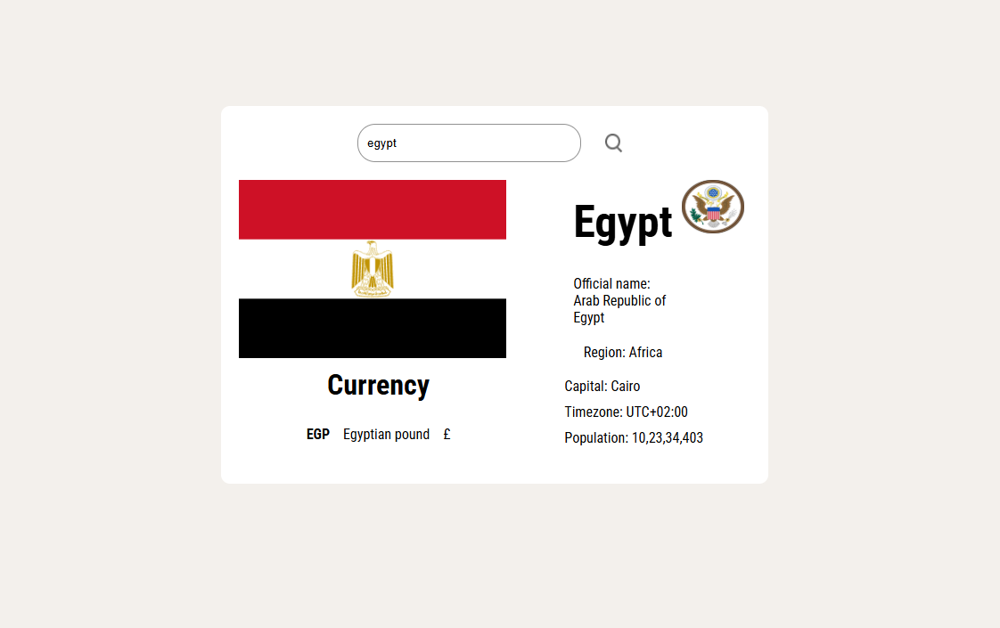

# Country Info React App

A simple React application to search and display information about countries using the [REST Countries API](https://restcountries.com/). Enter a country name to view its flag, official name, region, capital, timezone, population, coat of arms, and currency details.

---

## Preview



---

## Features
- 🔍 **Search** for any country by name
- 🏳️ **Flag** and 🛡️ **Coat of Arms** display
- 🏛️ **Official name**, **region**, **capital**
- 🕒 **Timezone** and 👥 **population**
- 💱 **Currency** code, name, and symbol
- Responsive, clean UI with [Roboto Condensed](https://fonts.google.com/specimen/Roboto+Condensed)

---

## Getting Started

### Prerequisites
- [Node.js](https://nodejs.org/) (v16 or higher recommended)
- [npm](https://www.npmjs.com/) or [yarn]

### Installation

```bash
npm install
```

### Running the App

```bash
npm run dev
```

The app will be available at [http://localhost:5173](http://localhost:5173) (or as indicated in your terminal).

---

## Usage
1. Type a country name in the search bar (e.g., `France`, `Japan`, `Brazil`).
2. Click the search icon or press Enter.
3. View the country's details, including flag, coat of arms, currency, and more.

By default, the app loads information for the USA.

---

## Project Structure
- `src/component/Country.tsx` – Main component for fetching and displaying country data
- `src/component/Country.css` – Styling for the country info card
- `public/image.png` – App preview screenshot

---

## API Reference
- [REST Countries v3.1](https://restcountries.com/)

---

## License
MIT
